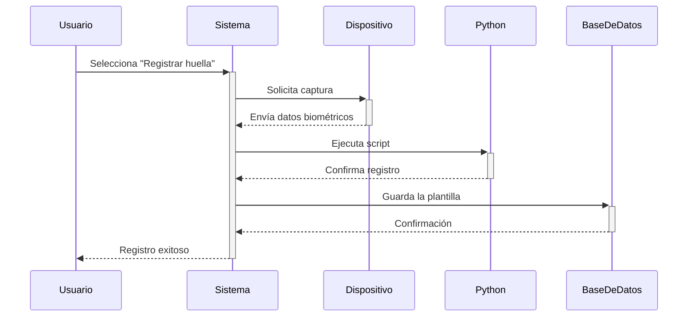

# 🧬 BioSystem - Sistema Biométrico de Gestión Estudiantil


**BioSystem** es una solución integral para instituciones educativas que fusiona gestión académica y autenticación biométrica mediante huellas digitales.

---

## ✨ Características Principales

- 🔐 **Autenticación dual**: credenciales tradicionales y huellas digitales  
- 👨‍🎓 **Gestión estudiantil completa**: registrar, actualizar, deshabilitar y habilitar  
- 📊 **Sistema biométrico**: registro, verificación y actualización de huellas  
- 📈 **Reportes**: asistencia, actividad y control académico  
- 💰 **Control de deudas**: seguimiento de obligaciones económicas  

---

## ⚙️ Tecnologías Utilizadas

### 🧠 Backend
- **Laravel 10+** – Framework principal  
- **Eloquent ORM** – Mapeo de datos  
- **Python 3.8+** – Integración con sensores biométricos  
- **MySQL** – Base de datos relacional  

### 🎨 Frontend
- **Tailwind CSS** – Estilos minimalistas  
- **Vite** – Empaquetador moderno  
- **Alpine.js** – Interactividad ligera  
- **Font Awesome** – Iconografía visual  

### 🧩 Hardware
- **Futronic FS88 / FS88H**  
- DLLs utilizadas: `FTRAPI.dll`, `ftrScanAPI.dll`  

---

## 🗂️ Estructura del Proyecto

```bash
.
├── app
│   ├── Http
│   │   ├── Controllers     # Lógica del sistema
│   │   └── Middleware      # Control de accesos
│   ├── Models              # Modelos Eloquent
│   └── Providers           # Service Providers
├── resources
│   ├── python              # Scripts biométricos
│   └── views               # Vistas Blade
├── public
│   └── build               # Assets compilados
├── routes
│   └── web.php             # Rutas web
└── database
    ├── migrations          # Estructura de tablas
    └── seeders             # Datos semilla
```

---

## 🚀 Instalación

### 🔧 Requisitos Previos

- PHP 8.1+  
- Composer  
- Node.js 16+  
- Python 3.8+  
- MySQL 5.7+

### 📦 Pasos de instalación

```bash
# Clona el repositorio
git clone https://github.com/tu-usuario/biosystem.git
cd biosystem

# Instala dependencias PHP
composer install

# Instala dependencias JavaScript
npm install

# Configura el entorno
cp .env.example .env
php artisan key:generate

# Configura rutas biométricas en .env
# .env
BIOMETRIC_DEVICE_PATH=C:\ruta\al\dispositivo
BIOMETRIC_SCRIPT_PATH=resources/python/

# Ejecuta migraciones
php artisan migrate --seed

# Compila assets
npm run build

# Inicia el servidor
php artisan serve
```

---

## 👆 Uso de la Biometría

### 🔄 Flujo de Registro de Huella



---

## 🐍 Scripts Python Disponibles

| Script                    | Función                                       |
|--------------------------|-----------------------------------------------|
| `agregarHuellaExistente.py` | Asocia huella a estudiante existente        |
| `login.py`               | Autenticación biométrica                      |
| `probarDispositivo.py`   | Verifica estado del lector                    |
| `agregarEstudiante.py`   | Registro de estudiante con huella             |

---

## 📸 Capturas de Pantalla

> _Haz clic para ampliar si estás en GitHub_

-   
  _Panel de administración_

-   
  _Registro de huellas_

-   
  _Panel de control académico_

---


---

## 📄 Licencia

Este proyecto está bajo la licencia **MIT**.

---

> **BioSystem** — Gestión Estudiantil con Biometría  
> Desarrollado con ❤️ para transformar la educación con seguridad e innovación.
