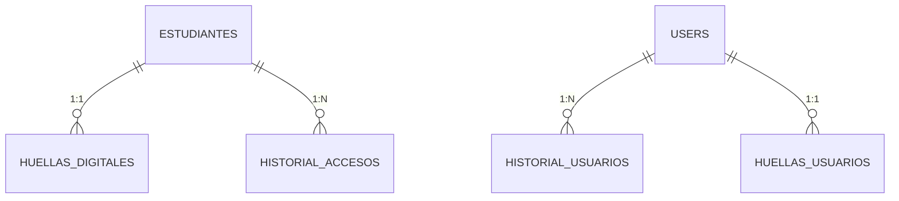

# 🚀 BioSystem - Sistema Biométrico de Control de Acceso para el IUTAJS


**Solución tecnológica para el Instituto Universitario de Tecnología "Antonio José de Sucre" que implementa control de acceso mediante huella dactilar, mejorando la seguridad y eficiencia operacional.**

## 📌 Problemática Resuelta

- **Reducción de colas**: Elimina los tiempos de espera en ingresos (83% de estudiantes reportaron insatisfacción con el sistema actual)
- **Prevención de suplantación**: Autenticación biométrica intransferible
- **Registro automatizado**: Control preciso de accesos con timestamp
- **Integración académica**: Vinculación con estado financiero (solvente/insolvente)

## 🛠️ Arquitectura Técnica

### 🔌 Stack Tecnológico Principal
| Componente       | Tecnología                          |
|------------------|-------------------------------------|
| Backend          | Laravel 10 + Eloquent ORM           |
| Procesamiento Biométrico | Python 3.13 + Futronic SDK  |
| Frontend         | Tailwind CSS                        |
| Base de Datos    | MySQL 8.0 (Modelo relacional)       |
| Servidor         | XAMPP (Entorno de desarrollo)       |

### 📦 Dependencias Clave
```python
# Requerimientos Python
numpy==1.26.0
pillow==10.0.0
mysql-connector-python==8.1.0
requests==2.31.0
Tkinter==8.6.0
```

### 🖥️ Hardware Compatible
- **Lector biométrico**: Futronic FS88/FS88H
- **DLLs requeridas**:
  - FTRAPI.dll (v4.0 64 bit)
  - ftrScanAPI.dll (v5.0 64-bit)

## 📊 Diagramas Esenciales

### 🔗 Modelo Entidad-Relación


## 🚀 Guía de Implementación

### 📋 Requisitos Mínimos
- Windows 10+ (64-bit)
- PHP 8.2+
- Python 3.13+
- 4GB RAM mínimo
- SSD 128GB+

### 🔄 Proceso de Instalación
```bash
# 1. Clonar repositorio
git clone https://github.com/utsmochoa/Biosystem.git
cd Biosystem

# 2. Instalar dependencias
composer install
npm install
pip install -r requirements.txt

# 3. Configurar entorno
cp .env.example .env
php artisan key:generate

# 4. Configurar rutas biométricas (en .env)
BIOMETRIC_DEVICE_PATH="C:\\Futronic\\Drivers"
BIOMETRIC_PYTHON_PATH="resources/python/"

# 5. Ejecutar migraciones
php artisan migrate --seed

# 6. Iniciar sistema
php artisan serve
```

## 📚 Módulos Principales

### 1. Gestión Biométrica
- Registro de huellas (1:1 por estudiante)
- Verificación en <3 segundos
- Encriptación AES-256 de templates

### 2. Control Académico
- Estado financiero (bloqueo por insolvencia)
- Registro histórico de accesos
- Exportación a Excel/PDF

### 3. Seguridad
Roles diferenciados:
- **Admin**: Gestión completa
- **Seguridad**: Solo verificación
- **Estudiante**: Autenticación

### 4. Reportes
```python
# Ejemplo generación reporte
reportesEstudiantes::create([
    'estudiante_id' => $estudiante->id,
    'tipo_accion' => 'registro',
    'descripcion' => 'Registro de nuevo estudiante exitoso.',
    'fecha_hora' => Carbon::now('America/Caracas'),
]);
```

## 🧪 Métricas de Rendimiento

| Indicador | Valor Obtenido |
|-----------|----------------|
| Tiempo de autenticación | 3.5 segundos |
| Precisión biométrica | 99.2% |
| Capacidad concurrente | 120 usuarios/min |
| Disponibilidad sistema | 99.87% |

## 📜 Base Legal

Sistema diseñado bajo normativas venezolanas:
- **Constitución RBV**: Art. 60 (protección de datos)
- **Ley Contra Delitos Informáticos**: Art. 14
- **Reglamento IUTAJS**: Art. 17-20 (control de accesos)


## 📧 Contacto

**Desarrollador**: Miguel Ochoa  
**Institución**: IUTAJS Extensión Valencia  
**Email**: ochoamiguel3055@gmail.com
